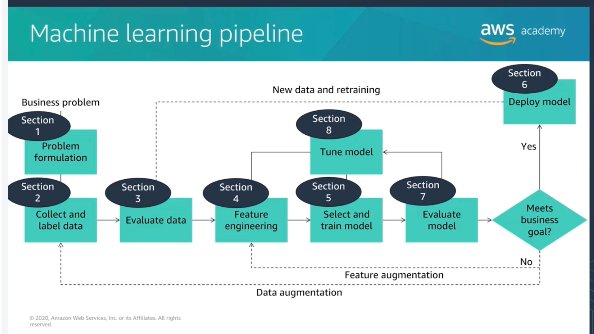
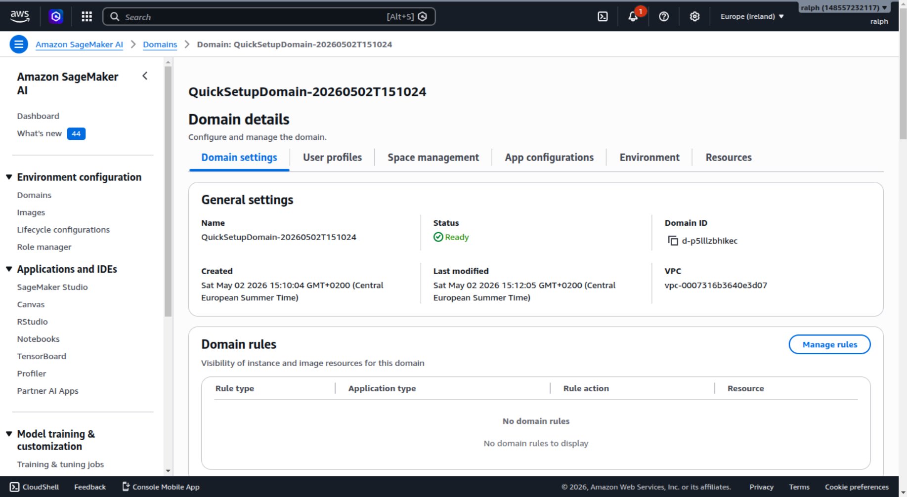
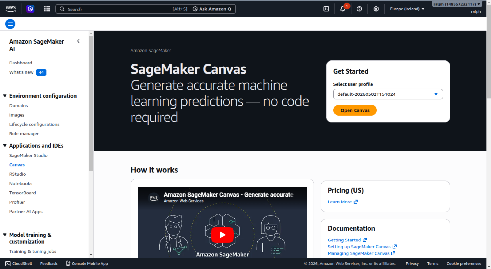
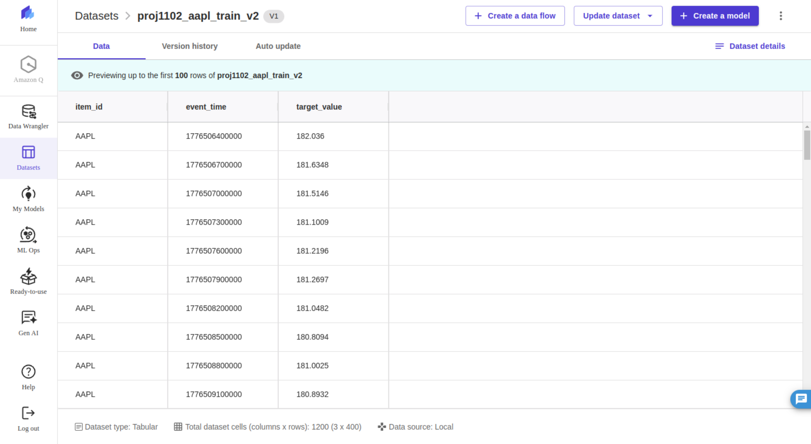
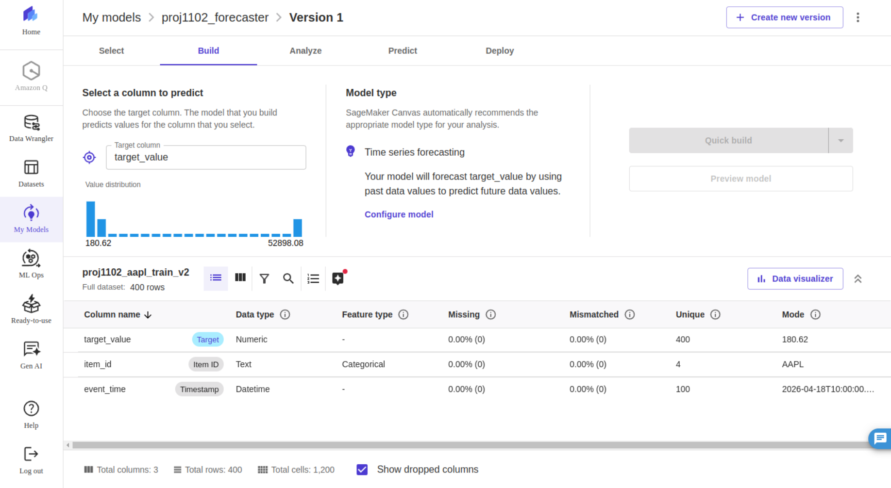
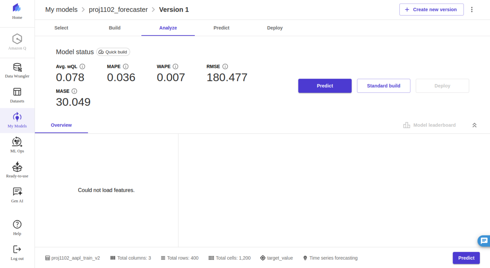
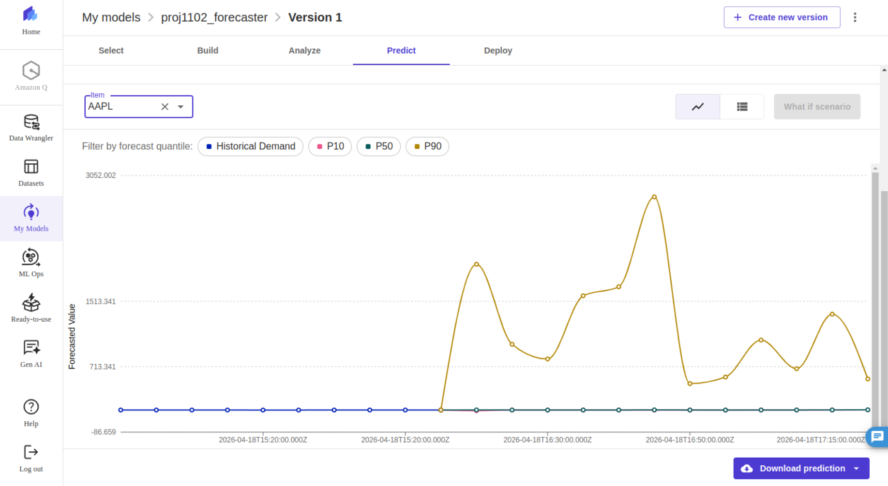

# Research on AWS SageMaker AI

**Team 11_02 — CCBDA-MIRI · UPC Barcelona · May 2026**
Arthur Bohin · Dalibor Švonavec · Ilias El Mariky · Francesco Barillari · Ralph Khairallah

---

## 1. Introduction

In traditional programming, developers define a set of rules (e.g. `if/else` conditions) to solve a problem. This approach becomes inefficient or infeasible when dealing with complex tasks or large amounts of data. Machine Learning overcomes this limitation by training models on historical data to automatically identify patterns and generalize to new inputs, then make predictions or decisions.

## 2. Why ML on AWS in 2026?

Machine learning is no longer optional. McKinsey's 2026 Global AI Survey shows **88 % of organizations** now use AI in at least one business function — up from 78 % just one year earlier. The bottleneck has shifted from *"should we use ML?"* to *"how do we ship it without managing GPUs ourselves?"* — which is exactly what managed services like SageMaker solve.

Key adoption stats (May 2026):

- **88 %** of organizations report regular AI use in at least one function (up from 78 % in 2025).
- **72 %** of enterprises have at least one AI workload in production, vs. 20 % in 2020 — a 3.6× increase in 6 years.
- **65 %** of enterprises increased their AI budgets in 2026 (median +22 % YoY).
- Tech & software lead at **88 %** adoption, financial services at **79 %**, healthcare at **62 %**.

> *"The era of AI as a competitive differentiator is ending; AI is becoming the baseline."*
> — McKinsey Global AI Survey 2026

## 3. The ML pipeline

To effectively apply machine learning, practitioners typically follow a structured workflow known as the **machine learning pipeline**. This pipeline includes several key steps: problem formulation, data collection and labeling, data evaluation and cleaning, feature engineering, model training, model evaluation, and finally model deployment and tuning.




## 4. What is Amazon SageMaker AI?

**Amazon SageMaker AI** is a fully managed platform that supports this entire machine learning pipeline. It provides tools 
to build, train, and deploy models at scale, enabling users to manage **all stages of the ML workflow** within a unified environment. 
While SageMaker can be used for different types of machine learning, it is often applied to supervised learning tasks, 
such as prediction problems based on historical data.
SageMaker AI operates on a **pay-per-use model** and removes the need to manage infrastructure, while being **deeply integrated
with other AWS services** like S3, Lambda, IAM, and CloudWatch. Before SageMaker, developing ML systems required setting up GPU 
servers, configuring distributed training, and managing deployment and monitoring manually. SageMaker simplifies this process
by turning these steps into managed services — users only need to provide data and model code, while AWS handles the underlying infrastructure.

However, SageMaker AI represents only the machine learning component of a larger ecosystem: Amazon SageMaker Unified Studio.
Unified Studio brings together data analytics, data engineering, and machine learning tools into a single 
environment, built on a well-managed lakehouse architecture.
As a result, all users — from SQL analysts to machine learning engineers — can work on the same reliable data, 
with consistent security and access controls. This helps solve common enterprise problems like data silos and disconnected tools.
This unified approach is already delivering real benefits. Companies using the platform report faster insights and better collaboration
across teams, thanks to having everything in one place. For further details on Unified Studio, see the article “Inside Amazon SageMaker Unified Studio” in the references section.

## 5. SageMaker's surfaces — one service, many ways in

SageMaker is really many products under one roof. Pick the interface that matches your skill level.

| Surface | What it is | Best for | Interface |
|---|---|---|---|
| **Canvas** | No-code visual ML builder, drag & drop | Business analysts, demos, quick prototypes | Web UI |
| **Autopilot** | AutoML engine — auto algorithm selection, training, tuning | Teams that want the best model without manual hyperparameter search | API + Canvas |
| **Studio Notebooks** | Cloud Jupyter pre-loaded with every ML library | Data scientists exploring data and building custom models | Jupyter |
| **SDK / boto3** | Python API to train, deploy, and predict | Production engineers, automation, Lambdas | Python code |
| **JumpStart** | Library of pre-trained models, 1-click deploy | Skipping training when a model already exists | Web UI + API |
| **Pipelines** | Workflow orchestrator for end-to-end ML steps | Production-grade, reproducible, version-controlled ML | SDK + UI |

**Key takeaway:** all surfaces share the same underlying compute, models, and endpoints. Canvas runs on Autopilot under the hood — you can call Autopilot directly from the SDK too. Start in Canvas to validate, graduate to the SDK when you go to production.

## 6. Tutorial — Path A: from a CSV to a trained model in Canvas

This walkthrough mirrors what we did in our project: take a financial time-series CSV, train a forecasting model with **zero code**, and inspect the results.

### Step 1 — Create the workspace

From the AWS console, open SageMaker AI → Domains → create one (or open the existing one). The domain is your team's shared ML workspace — Studio, Canvas, Notebooks all live inside.



Once the domain shows status **Ready**, click into it and open the Apps tab.

### Step 2 — Launch Canvas

From the domain → click **Open Canvas** (orange button). Canvas runs as a managed application on top of your domain.



> ⚠ Canvas is billed per hour while running (~$1.13 /h on `ml.m5.4xlarge`). Always click **Log out** when finished — closing the browser tab does *not* stop billing.

### Step 3 — Upload the dataset

Inside Canvas → **Datasets** → import the CSV. Canvas previews the rows and **auto-detects column types** — no schema definition needed.



In our example dataset (`proj1102_aapl_train_v2`), Canvas detected three columns automatically: `item_id` (text), `event_time` (timestamp) and `target_value` (numeric).

### Step 4 — Configure the model

Click **+ Create a model** → name it → choose **Predictive analysis**. On the Build screen Canvas shows you the inferred problem type (here: time-series forecasting), the value distribution and quality stats per column.



Three columns map to three roles:
- **Target** = `target_value` (what we want to predict)
- **Item ID** = `item_id` (the entity we're forecasting per — e.g. ticker)
- **Time stamp** = `event_time` (the time axis)

### Step 5 — Train the model

Click **Quick build**. Canvas spins up the cluster, trains a DeepAR model under the hood, and reports the metrics back ~14 minutes later.



Metrics from our run on 400 rows of dummy data:

| Metric | Value |
|---|---|
| Avg. wQL | 0.078 |
| MAPE | 0.036 |
| WAPE | 0.007 |
| RMSE | 180.477 |
| MASE | 30.049 |

A wQL of 0.078 means very tight forecast quantiles. MAPE of 3.6 % means predictions are within ~4 % of the truth on average. All this without writing a line of ML code or provisioning a single server.

### Step 6 — Get predictions

Switch to the **Predict** tab → pick an item from the dropdown (e.g. `AAPL`). Canvas charts historical + forecast with three quantile bands (P10, P50, P90).



> 📌 **Honest note about this chart.** Our training dataset deliberately mixed prices for AAPL (~180 USD), TSLA (~200 USD), ETH (~3,500 USD) and BTC (~55,000 USD) in the same `target_value` column. Canvas trained one global model across all 4 items, so when forecasting AAPL the **P50** correctly hugs AAPL's range, but the **P90** reflects the upper-tail spread across the whole mix. The lesson is real: **Canvas does not validate your data prep**. For multi-item series with very different scales, normalize per item or train one model per item.

## 7. Tutorial — Path B: same workflow in Python

Once you've validated an approach in Canvas, you graduate to the SDK so the whole thing can run in a Lambda or Step Function.

```python
import sagemaker
from sagemaker.image_uris import retrieve

session = sagemaker.Session()
role = sagemaker.get_execution_role()
image_uri = retrieve(framework="forecasting-deepar",
                     region=session.boto_region_name)

estimator = sagemaker.estimator.Estimator(
    image_uri=image_uri,
    role=role,
    instance_count=1,
    instance_type="ml.c5.xlarge",
    output_path="s3://my-bucket/deepar/output",
)

estimator.set_hyperparameters(
    time_freq="5min",
    context_length=100,
    prediction_length=12,   # forecast 1 hour ahead at 5-min granularity
    epochs=50,
    num_cells=40,
    num_layers=2,
)

estimator.fit({"train": "s3://my-bucket/deepar/data/train.jsonl"})

predictor = estimator.deploy(
    initial_instance_count=1,
    instance_type="ml.t2.medium",
)

response = predictor.predict({
    "instances": [{"start": "2026-04-18T10:00:00",
                   "target": [182.04, 181.63, 181.51]}],
    "configuration": {"num_samples": 100,
                      "output_types": ["quantiles"],
                      "quantiles": ["0.1", "0.5", "0.9"]},
})
```

The full version of this script is at [`code/sagemaker_train.py`](code/sagemaker_train.py). Same DeepAR model under the hood, same metrics — just programmable.

## 8. Built-in algorithms and time series forecasting

SageMaker ships 20+ built-in algorithms across five categories. The ones you'll actually encounter:

| Category | Algorithms | Use case |
|---|---|---|
| **General purpose** | XGBoost, Linear Learner, AutoGluon-Tabular, CatBoost | Classification & regression on tabular data |
| **Time series** | DeepAR | Forecasting — see next slide |
| **Unsupervised** | K-Means, PCA, Random Cut Forest | Clustering, dimensionality reduction, anomaly detection |
| **Text / NLP** | BlazingText, Seq2Seq, LDA | Word embeddings, translation, topic modeling |
| **Vision** | Image Classification, Object Detection, Semantic Segmentation | Image labeling, object detection, pixel-level tagging |

**Not built-in — separate services:**
- LLMs / generative AI → **Bedrock**
- Pre-trained models (Hugging Face, Stable Diffusion, etc.) → **JumpStart**

### Time series

One built-in algorithm. One AutoML ensemble. Pick your level of control.

| Approach | What it is | Best for |
|---|---|---|
| **DeepAR** *(our pick)* | RNN-based deep learning forecaster | Full control; many related series jointly (e.g. all 4 tickers + sentiment) |
| **Autopilot ensemble** *(minimal effort)* | Trains 6 models, stacks the best (ARIMA, Prophet, NPTS, ETS, CNN-QR, DeepAR+) | Best model with minimal effort |
| ↳ **ARIMA** *(baseline)* | Classical statistical model | Simple datasets, fewer than 100 series |
| ↳ **Prophet** *(interpretable)* | Additive model — trend + seasonality | Single series, interpretable results |

> ⚠️ ARIMA and Prophet are **not callable individually** from the SDK — they only run inside the Autopilot ensemble.

**Decision quick-rule:**
- Multiple series, full control → **DeepAR** via SDK
- One series, or want a fast benchmark → **Autopilot** (Prophet / ARIMA inside)

## 9. Pricing

### Free tier (first 2 months for new accounts)
- **250 h / month** on `ml.t3.medium` for **Studio Notebooks**
- **50 h / month** on `ml.m5.xlarge` for **training jobs**
- **125 h / month** on `ml.m5.xlarge` for **real-time inference**
- **25 h / month** on `ml.m5.4xlarge` for **Data Wrangler**
- **10 GB** of Feature Store storage + 10 M write/read units

### After free tier (eu-west-1, May 2026)

| Component | Instance | ~$/hour |
|---|---|---|
| Studio Notebook (cheap) | ml.t3.medium | $0.05 |
| Canvas session | ml.m5.4xlarge | $1.13 |
| Training (CPU) | ml.m5.xlarge | $0.27 |
| Training (GPU) | ml.p3.2xlarge | $4.20 |
| Real-time endpoint (small) | ml.t2.medium | $0.06 |
| Real-time endpoint (medium) | ml.m5.xlarge | $0.27 |

> ⚠ **"Zombie resources" warning.** A frequent complaint on SageMaker reviews: users delete an endpoint but forget the attached EBS volumes, elastic inference accelerators, or notebook resources, which **continue to bill indefinitely**. Cost monitoring is *not* automatic — set a CloudWatch billing alarm before you start.

## 10. When to use SageMaker vs alternatives

Not every ML problem needs SageMaker.

| Tool | Cloud | Best for | Trade-off |
|---|---|---|---|
| **AWS SageMaker** | AWS | Full ML lifecycle on AWS | Lock-in to AWS |
| **Google Vertex AI** | GCP | Same idea on GCP | Equivalent feature set |
| **Azure Machine Learning** | Azure | Same idea on Azure | Equivalent feature set |
| **MLflow on EC2 / K8s** | Cloud-agnostic | Avoiding lock-in | More setup work |
| **Hugging Face + Lambda** | AWS-light | Single inference endpoints | No training pipeline |
| **AWS Bedrock** | AWS | LLM / generative AI | Different problem space |
| **AWS Forecast** | AWS | (Was) managed time series | **Deprecated for new accounts since mid-2024** |

**Decision rules of thumb:**
- *"I need an LLM / chatbot"* → **Bedrock**
- *"I need to forecast time series and I'm a beginner"* → **SageMaker Canvas**
- *"I need to forecast time series at scale, automated"* → **SageMaker SDK + DeepAR**
- *"I need a custom ML model on tabular data"* → **SageMaker SDK + XGBoost**
- *"I'm avoiding AWS lock-in"* → MLflow on Kubernetes
- *"I just need to call a pre-trained model occasionally"* → Hugging Face + Lambda

## 11. Community sentiment & adoption

### Who actually uses it
- Featured AWS customers (May 2026): **Figma, Perplexity, Intuit, Itaú, Salesforce, Carrier, Swiss Life, NTT DATA, Toyota Motor North America, LG AI Research, Cerner, Sophos**.
- **NFL** uses SageMaker for the entire Next Gen Stats system, including the Completion Probability model that predicts pass-completion live during broadcasts.
- **Perplexity** accelerated foundation model training by **40 %** using SageMaker HyperPod.
- **LG AI Research** trained their EXAONE foundation model **59 % faster** using SageMaker's distributed training.
- Official **AWS SageMaker Examples** GitHub repo: **10,900+ ⭐ · 7,000+ forks**.

### What people love vs. complain about

| ✓ Loved | ⚠ Complaints |
|---|---|
| One-touch deployment | Opaque pricing — "month-end shock" |
| Fully managed, scales easily | Steep learning curve for non-AWS natives |
| Wide framework support (TF / PyTorch / MXNet) | "Zombie resources" keep billing after deletion |
| Strong technical support | Vendor lock-in (model artifacts in SageMaker format) |

> *"One-touch deployment makes it easier to manage and access models expediently. SageMaker Studio is highly regarded for its overall package of deployment and management features."* — TrustRadius reviewer, 2025

> *"Opaque pricing models that lead to month-end shock, steep learning curves for non-AWS natives, and a 'walled garden' architecture that penalizes multi-cloud strategies."* — engineering team review, 2025

## 12. Common gotchas (lessons we learned the hard way)

1. **Service quotas hit 0 by default for new accounts.** Some instance types (e.g. `ml.m5.4xlarge` for transform jobs) are blocked until you file a quota request. Plan for 24–48 h delay.
2. **Region matching matters.** SageMaker, S3, QuickSight, DynamoDB, Athena — all need to be in the **same region**. We mixed `eu-west-1` and `eu-west-3` once and it cost a re-subscription.
3. **Cross-account S3 access requires a bucket policy.** Standard IAM permissions on your side aren't enough; the bucket owner must explicitly grant `s3:GetObject` to your IAM principal.
4. **Canvas keeps billing while idle.** Default auto-shutdown is 2 h. At ~$1.13 /h that adds up. Always click **Log out**.
5. **`timestamp` is a reserved keyword.** Both Athena and Canvas reject column names called `timestamp`. Rename to `event_time` before uploading.
6. **Canvas wants CSV, not Parquet.** Convert with pandas before upload if your data lake stores Parquet (typical Glue output).
7. **AWS Forecast is dead for new accounts.** Announced mid-2024. The error message is misleading (*"AccessDenied"* rather than *"service deprecated"*). If you start a project assuming you can use Forecast, you'll lose a day finding out you can't.

## 13. Personal perspective — our project pivot

Our team's Cloud Computing project was originally assigned **AWS Forecast**. On day one of week 2 we tried to create the first dataset group and AWS returned:

> *"Amazon Forecast is no longer available to new customers. Existing customers of Amazon Forecast can continue to use the service as normal."*

We tested in `us-east-1`, `us-west-2`, `eu-west-1`, `eu-central-1` — same error in every region. Forecast was deprecated for new customers in mid-2024.

**What we did:**
- Pivoted to **SageMaker** with the professor's approval.
- Kept the same architecture (S3 → ML service → S3) — only the service changed.
- Used **Canvas** for our Thursday demo (model trained in 14 minutes) and the **Python SDK** for the production-style version that runs in a Lambda.

**What we learned:**
- **Check service availability before committing.** AWS deprecates managed services more often than they announce.
- **For time-series forecasting in 2026, SageMaker DeepAR is the natural successor to Forecast** — same algorithm under the hood, just exposed at a lower level.
- **Cross-account access, region mismatches, and quota walls** cost us roughly 1.5 days combined. Half of that would have been avoided with a single shared AWS account from day one.

## 14. Resources

### Official AWS documentation
- SageMaker AI homepage: <https://aws.amazon.com/sagemaker/ai/>
- SageMaker AI customers (case studies): <https://aws.amazon.com/sagemaker/ai/customers/>
- Developer Guide: <https://docs.aws.amazon.com/sagemaker/latest/dg/whatis.html>
- Python SDK reference: <https://sagemaker.readthedocs.io/>
- Built-in algorithms list: <https://docs.aws.amazon.com/sagemaker/latest/dg/algos.html>
- DeepAR algorithm reference: <https://docs.aws.amazon.com/sagemaker/latest/dg/deepar.html>
- Pricing: <https://aws.amazon.com/sagemaker/ai/pricing/>

### Free hands-on courses
- **AWS Skill Builder** — SageMaker learning paths: <https://explore.skillbuilder.aws/learn>
- **AWS Academy Machine Learning Foundations** (the course referenced in our brief)
- **SageMaker Studio Lab** — free Jupyter, no AWS account needed: <https://studiolab.sagemaker.aws/>

### Code examples
- Official **AWS SageMaker Examples GitHub** (10.9 k ⭐): <https://github.com/aws/amazon-sagemaker-examples>
- AWS Machine Learning Blog: <https://aws.amazon.com/blogs/machine-learning/>

### Reading
- **DeepAR paper** (Salinas, Flunkert, Gasthaus, 2017): <https://arxiv.org/abs/1704.04110>
- **NFL on SageMaker** flagship case study: <https://aws.amazon.com/blogs/machine-learning/football-tracking-in-the-nfl-with-amazon-sagemaker/>
- Andrew Ng's *Machine Learning Yearning* (free PDF): <https://www.deeplearning.ai/machine-learning-yearning/>
-  Medium (Nicolò Grando, 2025): *Inside Amazon SageMaker Unified Studio: A unified data analytics and AI platform on AWS* : https://medium.com/@nicolo.g88/inside-amazon-sagemaker-unified-studio-a-unified-data-analytics-and-ai-platform-on-aws-93e5d5cc3cff

### Community Q&A
- **AWS re:Post** — SageMaker tag: <https://repost.aws/tags/TAcZNaZUYKQbq2BTNJL5SoKw/amazon-sage-maker>
- **Stack Overflow** `amazon-sagemaker` tag: <https://stackoverflow.com/questions/tagged/amazon-sagemaker>
- Saturn Cloud (Hugo Shi, 2024): *A Detailed Guide to Amazon SageMaker* : https://saturncloud.io/blog/a-detailed-guide-to-amazon-sagemaker/

### Reviews & comparisons
- G2 SageMaker reviews: <https://www.g2.com/products/amazon-sagemaker/reviews>
- PeerSpot SageMaker pros / cons: <https://www.peerspot.com/products/amazon-sagemaker-pros-and-cons>
- TrustRadius SageMaker reviews: <https://www.trustradius.com/products/amazon-sagemaker/reviews>
